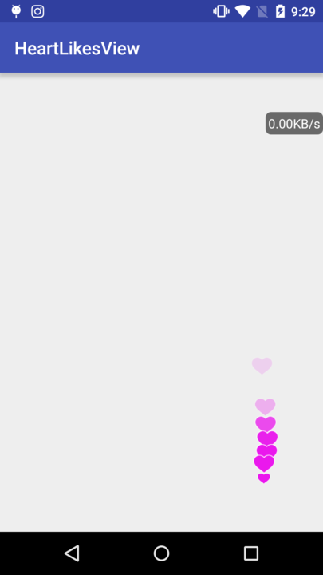
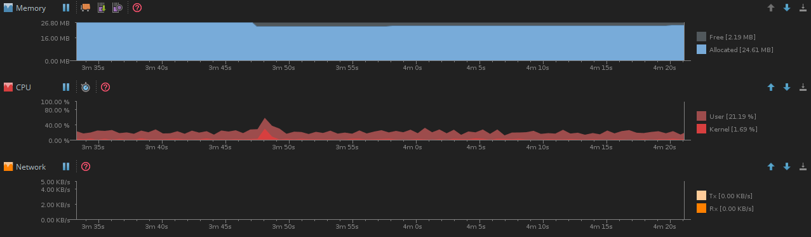

# HeartLikesView
直播点赞动画实现方案目前基本有三种，一是属性动画方式，这也是目前用的比较多的一种，优点是效果比较容易控制，缺点也比较明显，相对来说比较耗费CPU和内存；二是自定义继承于View的方式，通过画笔画出来，性能较好，但是在主线程绘制会导致ANR风险；三是自定义继承于SurfaceView的方式，这种方式相比View来说不存在AN风险，因为是开子线程来绘制图像，优点是性能很好。不过对于Bitmap的使用需要谨慎，处理不好也会有OOM问题。


HeartLikesView使用SurfaceView作为实现载体，结合了属性动画的实现方案，目的是开发出一个性能较为优秀的直播点赞动画功能。




目前，基本达到项目使用的需求，当然还有很多优化的空间，欢迎fork你的一份力量。

下面是githu中整理的实现方案，及供参考：

1、View方式

https://github.com/HomHomLin/Android-DivergeView


2、SurfaceView方式

https://github.com/zhangjinyuanfly/project

3、属性动画方式

https://github.com/tyrantgit/HeartLayout


https://github.com/Yasic/QQBubbleView


https://github.com/Vincenter/Periscrope


https://github.com/AlanCheen/PeriscopeLayout

## 使用方式

重写Activit的onTouchEvent方法，
```java

@Override
    public boolean onTouchEvent(MotionEvent event) {
        if(event.getAction() == MotionEvent.ACTION_UP){
            mLikeView.click();
        }
        return super.onTouchEvent(event);
    }
  
```

## License

    Copyright 2016 Kince

    Licensed under the Apache License, Version 2.0 (the "License");
    you may not use this file except in compliance with the License.
    You may obtain a copy of the License at

       http://www.apache.org/licenses/LICENSE-2.0

    Unless required by applicable law or agreed to in writing, software
    distributed under the License is distributed on an "AS IS" BASIS,
    WITHOUT WARRANTIES OR CONDITIONS OF ANY KIND, either express or implied.
    See the License for the specific language governing permissions and
    limitations under the License.
